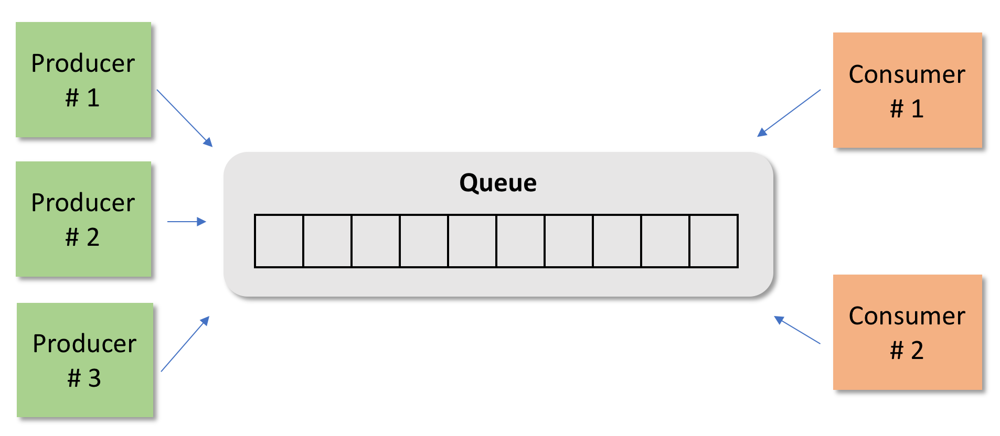

##  HvA PC :: Assignment 2
This is an introductory exercise about the **Producer/Consumer** design pattern. 

## Prerequisites
You must have an IDE to work on this project. We recommend using the [IntelliJ IDEA Community Edition](https://www.jetbrains.com/idea/download/#section=mac). This IDE has good integration with Maven and JUnit.

### Installation & Configuration

Download or clone this project and open it using your IDE

### Exercise

This exercise has three classes, represented by the figure below: A family of producers, a family of consumers, and a common resource (a queue in this example)

#### Part 1: Analysis:

- Take a look at the source code
- Examine the Main class: This class create some producers and consumers and start them as threads. Note that producers and consumers have a unique id, a reference to the queue and the number of elements to produce and consume.
- Take a look at the Queue class. Note that a Queue is limited to 10 elements. If a producer tries to add an element in the queue and there is no space, the expected behaviour is to wait until some consumer remove one element so that the producer can use the empty spot. A similar situation happens with a consumer that tries to get elements from an empty Queue. The consumer should wait until something is inserted into the Queue.

#### Part 2: Execution:

Try to execute the program. You will see that something strange is happening. 

#### Part 3: Diagnostic:
Your task is to discover what is happening. You can debug, log texts in the console to better understand the behaviour of the application.

#### Part 4: Solution
Propose a solution to the problem. 